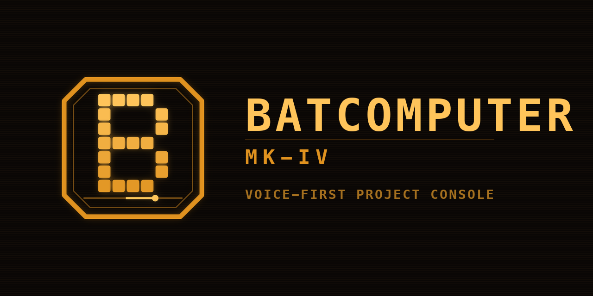

# Batcomputer MK-IV

A voice-first project console that runs entirely in your browser: a project board, idea map, file store, AI
agents, live request tracking, and connections to smart lights and online services. There is no server and no
account -- your data and your API keys stay in *your* browser on *your* device.



## Use it on your phone

1. Open the site's address (`https://<your-github-name>.github.io/<repo-name>/`) on your phone.
2. **iPhone / iPad (Safari):** Share -> *Add to Home Screen*.  **Android (Chrome):** menu -> *Install app* (or *Add to Home screen*).
3. Open it from the new icon. It starts full-screen and keeps working with no connection (AI replies still need one).
4. First run: open **CONFIG** (top right) and paste your AI key.

## What works where

| | Phone / GitHub Pages (https) | Laptop opened from a local file |
|---|---|---|
| Projects, ideas, files, agents, tracker | yes | yes |
| AI replies, GitHub / Vercel / Netlify / Notion / Linear, weather, reminders | yes | yes |
| Home Assistant | only if it is reachable over `https` (e.g. Nabu Casa) | yes, on the same network |
| Voice input | Chrome on Android; not iPhone Safari (type instead) | Chrome / Edge |
| Home Control app (Hue lights and other gadgets on your Wi-Fi) | **no** (see below) | yes, on the same network |
| Phone alerts: your calls and texts shown as they arrive (via ntfy) | yes | yes |
| Car display (`?car=1`, full-screen phone display) | yes | yes |
| APPS (built-in apps, plus pages it builds for you) | yes | yes |
| Obsidian vault folder | no (browsers on phones cannot open folders) | Chrome / Edge |

**Why Hue doesn't work from the phone site:** the bridge only speaks plain `http` on your home network, and a browser
will not let an `https` website talk to plain `http` devices. Open the app from the file on your computer (or any
`http` address on your network) when you want to control lights.

## Your data

Everything is stored in the browser you use. The phone and the laptop are separate copies. To move data between them:
**ARCHIVE -> EXPORT_ALL_JSON** on one, **IMPORT_JSON** on the other. The export file contains your saved tokens, so keep it private.

## Updating

Edit `source/batcomputer.src.html` in the original project, run `python3 tools/publish.py`, then commit and push this
folder. Installed copies pick up the new version the next time they open while online.

## Publish it (once)

```bash
cd batcomputer-web
git init -b main && git add . && git commit -m "Batcomputer"
# create an empty repo on github.com (public), then:
git remote add origin https://github.com/<your-github-name>/<repo-name>.git
git push -u origin main
```

Then on GitHub: **Settings -> Pages -> Build and deployment -> Deploy from a branch -> `main` / `(root)`**. The site
appears at `https://<your-github-name>.github.io/<repo-name>/` after a minute. (Pages on a private repo needs a paid
GitHub plan; a public repo is fine because the app holds no secrets -- anyone opening it still needs their own AI key.)
Set `logo/social-preview.png` as the repo's social preview under **Settings -> General** if you like.

## Logo

`logo/` has the mark and wordmark as SVG and PNG. `icons/` has the phone and browser icons. Regenerate with
`python3 tools/make_logo.py`.
